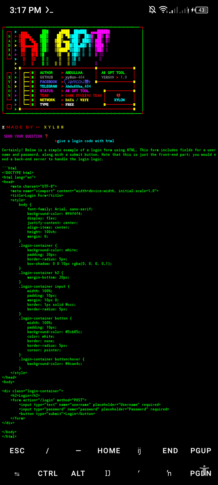
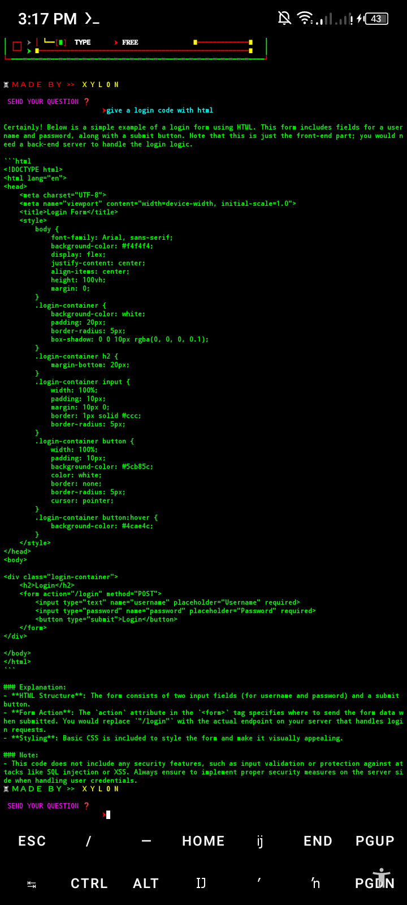

# 𝗔𝗜 𝗚𝗣𝗧 𝗔𝗗𝗩𝗔𝗡𝗖𝗘𝗗 𝗧𝗢𝗢𝗟🌚🫶

<p align="center">

#### Language > </br>

 </td>
    <td align="center" width="96">
      <a href="#macropower-tech">
        
      </a>
      <br>Python

## Requirements - 
- Stable Internet Connection
- 400+ MB Storage
- Termux Version Upto Date
- Android 7 or higher
- Required modules in requirements.txt
- No Root
- No Termux Knowlegde

 <p align="center">
</p>
 <p align="center">
</p>

#### INSTALL TOOL ON TERMUX

```python
rm -rf AI-GPT
git clone https://github.com/Xylon-404/AI-GPT.git
cd AI-GPT
python ⌥⁣ᎪᎥᯓ᯽GᖘƬ✌︎.py
```

#### USERNAME 

https://t.me/Abdullha_404/985?single

#### Password 

https://t.me/Abdullha_404/985?single

# Give A Star ⭐

> You can also give this repository a star to show more people and they can use this repository
